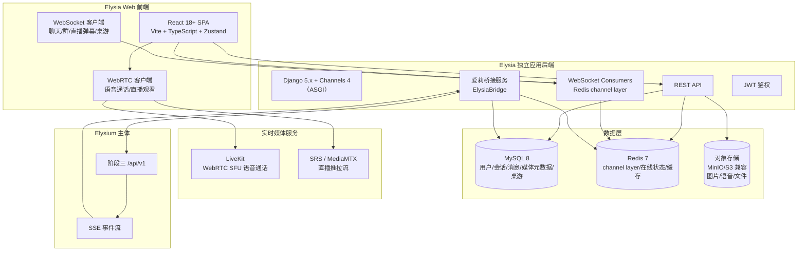

# 阶段四、五：Elysia 多媒体独立应用 —— 开发文档（技术方案）

> 文档状态：规划草案，待汐汐评审确认
> 上位规划：[Elysium 离线优先共享后端重构计划](../architecture/Elysium离线优先共享后端重构计划.md)（阶段 4/5）
> 前置依赖：[阶段三：Elysium 应用后端接口导出开发步骤](../architecture/阶段三-Elysium应用后端接口导出开发步骤.md)（已完成）
> 需求文档：[阶段四-Elysia多媒体独立应用需求文档](./阶段四-Elysia多媒体独立应用需求文档.md)
> 本文件是供后续 AI 直接执行的阶段四、五开发步骤，不是完成证明。

## 1. 系统架构总览



**关键架构决策**：
1. **Django + Channels + Redis** 作为应用后端唯一入口：HTTP 请求/响应 + WebSocket 实时 + 后台任务统一 ASGI 承载。
2. **爱莉桥接服务**是应用后端核心模块，通过阶段三 `/api/v1` 代理爱莉的所有交互，**前端永不直连 Elysium**。
3. **语音通话用 LiveKit**（自托管 WebRTC SFU），**直播用 SRS/MediaMTX + OBS**（与爱莉现有直播架构一致），二者独立部署，不挤占 Django 事件循环。

## 2. 技术选型论证

### 2.1 后端框架：Django 5.x + Channels 4（选定）

| 维度 | Django 5 + Channels 4 | FastAPI | 结论 |
|---|---|---|---|
| 实时聊天 WebSocket | 官方 Channels，Redis channel layer 成熟 | 原生 async，但广播/群组要自建 | Django 胜 |
| 用户体系/ORM/Admin | 内置，迁移成熟 | 自建 | Django 胜 |
| 百人并发 | 单 worker 数千连接，远超需求 | 性能更高但对百人无感 | 平 |
| 未来 app API | DRF 成熟 | 原生好 | 平 |
| 短生命周期担忧 | Django 20 年长期维护，5.x async 稳定 | — | 不成立 |
| 爱莉接入（Python 全栈） | 与 Elysium 同语言，桥接服务同仓 | 同语言 | 平 |

**结论**：选 **Django 5.x + Channels 4 + Redis channel layer**。社交软件是"CRUD 密集 + 实时并存"，Django 全家桶显著降低开发与维护成本；百人并发对 Channels 是小数级；Django 5 async ORM 已稳定，配合 Daphne/uvicorn 跑 ASGI 即可。**"短生命周期框架"的担忧不成立**——Django 是长期维护的成熟框架。

### 2.2 前端框架：React 18+（选定）

| 维度 | React | Vue |
|---|---|---|
| AI 组件生态（chat UI/streaming） | Vercel AI SDK、CopilotKit 成熟 | 弱，需手写 |
| 爱莉接入（AI 优先） | 生态领先 | 较弱 |
| WebRTC/直播集成 | 生态丰富 | 可用但生态窄 |
| 未来 app（React Native） | 首选 | 需额外方案 |

**结论**：选 **React 18+ + Vite + TypeScript + Zustand**。核心是"爱莉方便接入"——AI 聊天/流式渲染的 React 生态 2026 年全面领先，未来 app 可走 React Native 复用逻辑。

### 2.3 实时通信：WebSocket（应用主通道）+ SSE（爱莉出站）

- **应用内聊天/直播弹幕/桌游**：WebSocket，双向、低延迟，用 Django Channels。
- **爱莉出站**：应用后端订阅 Elysium `/api/v1/events/stream`（SSE），再投影为应用内 WebSocket 消息推给前端。**继承阶段三决策 2（通用事件默认 SSE，双向/实时流用 WebSocket）**。

### 2.4 语音通话：LiveKit（自托管 WebRTC SFU）

- **理由**：ChatGPT Voice 同款引擎，Web SDK 一流，支持未来 AI 语音代理（livekit-agents 可直接接爱莉 Voice Live）。
- **接入**：Django 发 LiveKit JWT token → 前端 WebRTC 连 LiveKit → 语音频道 = LiveKit Room。
- **爱莉入会**：爱莉走 Elysium Voice Live（独立意识实例），应用侧通过 LiveKit participant 呈现。

### 2.5 直播：SRS/MediaMTX + OBS 推流 + HLS/WebRTC 播放

- **理由**：与爱莉现有直播架构（"同一意识 + 导演 + OBS 舞台"）天然对齐。
- **接入**：OBS/浏览器推流到 SRS/MediaMTX（RTMP/WHIP）→ 前端拉 HLS/WebRTC 播放；弹幕走应用 WebSocket。
- **爱莉直播**：应用后端通过阶段三 `/api/v1/livestream/*` 订阅爱莉直播状态，应用内呈现。

### 2.6 桌游：服务端权威状态机

- 狼人杀等桌游在应用后端维护权威状态（服务端权威 + 玩家私有视图），前端只渲染。
- **爱莉玩家**：通过阶段三 `/api/v1/tabletop/*` 与 Elysium 狼人杀引擎对接，AI 玩家策略在 Elysium 侧。

### 2.7 数据存储

- **MySQL 8**：应用数据（用户、会话、消息、媒体元数据、桌游状态、直播元数据）。
- **Redis 7**：channel layer、在线状态、缓存、限流。
- **对象存储（MinIO/S3 兼容）**：图片、语音、文件二进制。数据库只存媒体元数据 + 内容哈希（继承上位规划）。

### 2.8 技术栈汇总

| 层 | 选型 |
|---|---|
| 后端框架 | Django 5.x + Channels 4 + Daphne/uvicorn |
| REST API | Django REST Framework |
| 前端 | React 18+ + Vite + TypeScript + Zustand |
| 实时 | Django Channels + Redis channel layer（WS）；SSE（爱莉出站） |
| 数据库 | MySQL 8 + Redis 7 |
| 对象存储 | MinIO（S3 兼容） |
| 语音 | LiveKit（自托管 SFU） |
| 直播 | SRS 或 MediaMTX + OBS |
| 爱莉桥接 | 应用后端代理阶段三 `/api/v1` |
| 部署 | Docker Compose + Nginx |

## 3. 目录结构

```text
Elysia/
├── backend/                     # Django 独立应用后端
│   ├── manage.py
│   ├── config/                  # 项目配置
│   ├── apps/
│   │   ├── accounts/            # 用户/认证/好友
│   │   ├── chat/                # 私聊/群聊/消息/媒体
│   │   ├── emoji/               # 表情包
│   │   ├── voice/               # 语音通话（LiveKit 集成）
│   │   ├── livestream/          # 直播
│   │   ├── tabletop/            # 桌游
│   │   └── elysia_bridge/       # 爱莉桥接服务（核心）
│   ├── tests/
│   └── pyproject.toml
├── web/                         # React 前端
│   ├── src/
│   │   ├── pages/
│   │   ├── components/
│   │   ├── stores/
│   │   ├── services/            # API + WS 客户端 + 爱莉客户端
│   │   └── hooks/
│   └── package.json
├── app/                         # 未来移动端（暂空，阶段四/五不拟）
└── docs/
    ├── plans/                   # 阶段四/五需求与开发文档（本目录）
    └── architecture/            # 后续架构细化文档
```

## 4. 数据模型（核心表）

```text
# 用户域
users                 id, username, email, password_hash, nickname, avatar,
                      signature, status(online/away/dnd/invisible), created_at
friendships           id, user_id, friend_id, status(pending/accepted/blocked)
friend_requests       id, from_user, to_user, message, status, created_at

# 聊天域
conversations         id, type(private/group), title, owner_id, created_at
conversation_members  id, conversation_id, user_id, role(member/admin/owner),
                      muted, joined_at
messages              id, conversation_id, sender_id, type(text/image/voice/file/emoji),
                      content, media_id, reply_to, status(sent/delivered/read/recalled),
                      created_at, idempotency_key(unique)
message_reads         id, message_id, user_id, read_at

# 媒体域
media_objects         id, media_id(稳定uuid), owner_id, content_hash, mime_type,
                      size, storage_path, status(processing/ready), created_at

# 表情包
emoji_packs           id, owner_id, name, is_system, created_at
emoji_items           id, pack_id, media_id, tag, created_at

# 语音通话（LiveKit 元数据）
voice_channels        id, name, room_name(unique), owner_id, created_at

# 直播
live_rooms            id, name, owner_id, stream_key_hash, status(offline/live),
                      started_at, ended_at
live_danmaku          id, room_id, sender_id, content, created_at

# 桌游
tabletop_games        id, game_type(werewolf/...), name, rules_version
tabletop_rooms        id, game_id, name, owner_id, status(waiting/playing/ended),
                      created_at
tabletop_players      id, room_id, user_id, role, seat, alive
tabletop_events       id, room_id, sequence, event_type, payload_json, created_at

# 爱莉桥接
elysia_profile        id, user_id(爱莉在应用内用户), stream_id(爱莉stream_id),
                      platform(feishu/...), enabled
```

**设计要点**：
- `messages.idempotency_key` 唯一约束：继承阶段三幂等契约，重复提交返回原结果。
- `media_objects.content_hash`：媒体去重 + 完整性校验（继承上位规划）。
- `tabletop_events` 追加式事件日志：桌游回放/复盘 + 隐藏信息隔离。

## 5. 实时通信协议（应用内 WebSocket）

**连接**：`wss://host/ws/?token=<jwt>`，握手校验 JWT，鉴权失败关闭。

**消息帧**（JSON）：
```json
{
  "type": "message.new",
  "data": {
    "conversation_id": "...",
    "message_id": "...",
    "sender_id": "...",
    "content": "...",
    "media": null,
    "ts": "2026-08-10T00:00:00Z"
  }
}
```

**事件类型**：
- `message.new` / `message.recall` / `message.read` / `message.reaction`
- `presence.update`（在线状态）
- `typing`（正在输入）
- `live.danmaku` / `live.status`
- `tabletop.event` / `tabletop.view`
- `voice.state`（频道成员变化）
- `elysia.reply`（爱莉回复投影到应用内）

**幂等与恢复**：客户端重连后带 `last_message_seq`，服务端补发错过的消息；所有写操作带 `idempotency_key`。

## 6. 爱莉桥接服务（核心：ElysiaBridge）

### 6.1 角色与铁律

- 爱莉在应用内是一个**真实用户**（`elysia_profile` 记录其 user_id + stream_id）。
- **应用前端永不直连 Elysium `/api/v1`**；所有爱莉交互经应用后端 `elysia_bridge` 代理（继承阶段三决策 1）。
- 应用后端通过 **service credential**（阶段三 `/admin/credentials`）调用阶段三接口，不暴露给浏览器。

### 6.2 入站（用户 → 爱莉）

```text
用户发消息给爱莉
  → 前端 WebSocket → 应用后端
  → elysia_bridge 记录应用内消息
  → POST /api/v1/chat/messages:inject
      {stream_id: 爱莉的stream_id, content, sender_name, sender_id,
       chat_type, platform: "elysia-app"}
  → 触发爱莉思考（ON_MESSAGE_RECEIVED → Distributor → LifeChatter）
```

### 6.3 出站（爱莉 → 应用）

```text
应用后端订阅 GET /api/v1/events/stream（SSE，带 Bearer + Last-Event-ID）
  → 收到爱莉的 chat.message.* 事件（含 reply_target）
  → elysia_bridge 过滤出属于本应用 stream 的回复
  → 投影为应用内消息存入 messages 表
  → 通过 WebSocket 推给对应 conversation 的在线用户
  → 离线用户下次上线补发
```

### 6.4 爱莉多场景接入

| 场景 | 应用后端动作 | 阶段三接口 |
|---|---|---|
| 聊天 | 入站 inject + 出站 SSE 投影 | `/chat/messages:inject`、`/events/stream` |
| 语音 | 爱莉 Voice Live 实例入会，应用侧呈现 participant | `/voice-calls/*` |
| 直播 | 订阅爱莉直播状态，应用内展示 | `/livestream/*` |
| 桌游 | 爱莉作为 AI 玩家，接入狼人杀引擎 | `/tabletop/*` |

### 6.5 主体性约束（继承阶段三不变量）

- 应用只作为**带 actor/source 的观察**进入 Elysium，不替爱莉判断意义。
- 爱莉记忆/人格/意识为 Elysium 所有，应用只读授权投影，**不写主体文件**。
- 爱莉的"已表达"以 Elysium 侧真实发送/播放回执为准，应用不得伪造爱莉说过的话。

## 7. 各功能域实现方案

### 7.1 用户系统（M4-1）
- Django 用户模型扩展（`AbstractUser`），JWT（`djangorestframework-simplejwt`）。
- 好友关系表 + 申请流；在线状态用 Redis 维护 + WebSocket 广播。

### 7.2 聊天核心（M4-2）
- 消息写入 MySQL（带 `idempotency_key`），成功后经 channel layer 广播。
- 离线消息：上线时按 `last_message_seq` 拉取未读；`message_reads` 维护已读回执。
- 撤回（限时）、引用、@提及、表情回执均为消息事件，不伪造投递成功。

### 7.3 媒体（M4-3）
- 上传到对象存储，生成 `media_id` + 内容哈希；缩略图/波形/转写按需走阶段三 `/media/*` 派生能力或应用侧自建。
- 图片、语音、文件访问均需鉴权，未授权返回 403。

### 7.4 语音通话（M4-5）
- 语音频道 = LiveKit Room；Django 生成 LiveKit 访问 token（绑定用户 + 房间）。
- 前端 WebRTC 直连 LiveKit；通话状态元数据存 MySQL。
- 爱莉 Voice Live：通过阶段三 `/voice-calls/*` 建立，应用侧以 participant 呈现。

### 7.5 直播（M4-6）
- 主播用 OBS 推流到 SRS/MediaMTX（RTMP），前端拉 HLS/WebRTC 播放。
- 直播间元数据 + 弹幕存 MySQL，弹幕经 WebSocket 广播。
- 爱莉直播：订阅阶段三 `/livestream/status` + `/livestream/sessions/{id}/events`，应用内展示直播画面、弹幕与状态。

### 7.6 桌游（M4-7）
- 应用后端维护桌游房间权威状态（`tabletop_rooms/players/events`），玩家私有视图服务端按 actor 生成（不接受伪造 player id）。
- 狼人杀：确定性规则引擎在应用侧或复用 Elysium 规则；爱莉作为 AI 玩家接入 Elysium 狼人杀引擎。
- 复盘用 `tabletop_events` 追加式事件日志重建。

## 8. 里程碑实施步骤（供后续 AI 执行）

> 每个里程碑交付：代码 + 契约测试 + 端到端演示 + 更新部署文档。

### 阶段四（Django 后端）
- **M4-1 基座**：Django 5 + Channels 4 + Redis 脚手架；用户模型 + JWT + 好友；健康检查；Docker Compose（MySQL/Redis/MinIO）。✅ 已完成
- **M4-2 聊天核心**：消息模型 + 私聊/群聊 REST + WebSocket Consumers + 离线补发 + 已读/撤回/引用。✅ 已完成（见 [阶段四-M4-2聊天核心开发步骤.md](./阶段四-M4-2聊天核心开发步骤.md)）
- **M4-3 媒体**：对象存储上传 + 缩略图/波形 + 表情包 + 文件。
- **M4-4 爱莉桥接**：service credential 获取 + inject 入站 + SSE 出站投影 + 爱莉用户身份 + `elysia.reply` 事件。✅ 契约层已完成（见 [阶段四-M4-4爱莉桥接开发步骤.md](./阶段四-M4-4爱莉桥接开发步骤.md)；真实 E2E 待 Elysium 运行 + credential 验收）
- **M4-5 语音**：LiveKit 集成 + 语音频道 + token 签发 + 爱莉 Voice Live 接入。
- **M4-6 直播**：SRS/MediaMTX 集成 + 直播间 + 弹幕 + 爱莉直播订阅。
- **M4-7 桌游**：狼人杀房间 + 玩家视图 + AI 玩家 + 复盘。

### 阶段五（React 前端）
- **M5-1 基座**：Vite + React + TS + Zustand + 路由 + 登录注册 + 全局状态。
- **M5-2 聊天界面**：会话列表 + 聊天窗口 + 消息渲染（文本/图片/语音/文件/表情）+ 已读/撤回。
- **M5-3 语音界面**：语音频道 + 通话控制（静音/音量）。
- **M5-4 直播界面**：直播间 + 弹幕 + 播放器。
- **M5-5 桌游界面**：大厅 + 房间 + 游戏板（狼人杀）。
- **M5-6 爱莉集成**：爱莉资料页 + 爱莉对话 + 爱莉直播/语音/桌游入口。

## 9. 测试与验收

### 9.1 单元/契约测试
- 消息幂等：同一 `idempotency_key` 重复提交返回原结果，不同内容返回冲突。
- 权限：未授权用户无法读私聊/发消息/操作群管理（403）。
- 爱莉桥接：inject 入站 + SSE 出站投影的契约测试（应用侧 mock 阶段三接口）。

### 9.2 实时测试
- WebSocket 连接/重连/补发测试（用 `channels.testing.WebsocketCommunicator`）。
- 断线重连恢复消息；慢消费者不阻塞广播。

### 9.3 性能验收
- **百人并发压测**：100+ WebSocket 连接同时收发，P95 延迟 < 1s。
- 语音：2-8 人 LiveKit 通话端到端延迟 < 500ms。
- 直播：弹幕 < 1s，视频 5-15s（HLS）可接受。

### 9.4 端到端验收门
- 爱莉聊天闭环：用户发消息 → 爱莉思考 → 回复投影到应用内（真实 E2E）。
- 爱莉语音/直播/桌游场景各至少一条真实可演示路径。
- 未授权访问返回 403/404，媒体访问控制生效。
- 离线消息补发、幂等、断线重连通过测试。

## 10. 部署与运维

- **Docker Compose** 编排：Django + MySQL + Redis + MinIO + LiveKit + SRS/MediaMTX + Nginx。
- 环境变量注入密钥（Elysium service credential、LiveKit key/secret、DB 密码），不写入代码与文档。
- Nginx 反代 + WebSocket 升级头（`proxy_read_timeout` 拉长）+ TLS。
- 结构化日志 + 健康检查 + 基础指标。
- 爱莉桥接的 Elysium 连接信息（URL、credential）走本机配置，不提交仓库（继承部署纪律）。

## 11. 风险与未决策项

| 风险/未决策 | 说明 | 建议 |
|---|---|---|
| 直播方案 SRS vs MediaMTX | 两者都可用；SRS 文档全、MediaMTX 轻量 | 首期用 SRS（成熟），必要时换 |
| LiveKit 自托管带宽 | 语音需 STUN/TURN，公网部署要 coturn | 加 coturn，内网先行 |
| 爱莉 Voice Live 与 LiveKit 对接 | 爱莉侧是 Voice Live 意识实例，应用侧是 LiveKit 房间，桥接需协议转换 | 里程碑 M4-5 重点验证 |
| 桌游规则引擎归属 | 应用自建 or 复用 Elysium 狼人杀引擎 | 复用 Elysium 引擎（AI 玩家已有） |
| app 端技术 | React Native 复用 React 逻辑 | 阶段四/五不拟，后续再定 |
| 域名/服务器 | 未定 | 部署阶段再定 |

## 12. 与阶段三的衔接确认

- 阶段三已导出的 `/api/v1` 接口（chat/media/livestream/voice-calls/tabletop/admin）**正是本应用所有功能域的后端能力**，本应用是阶段三接口的第一消费方。
- 爱莉桥接严格遵循阶段三 14 条已确认决策（前端不直连、SSE 主协议、service credential、主体性不变量等）。
- 阶段四/五的"独立应用 API"与"前端接入"完成后，回到上位规划阶段 6（历史迁移）时，本应用数据域按"应用数据"域并入共享后端。

> 开发推进建议：先做 M4-1 + M4-2（基座 + 聊天核心），跑通爱莉桥接 M4-4（爱莉聊天闭环），再做媒体/语音/直播/桌游。前端 M5 按后端里程碑同步推进。
